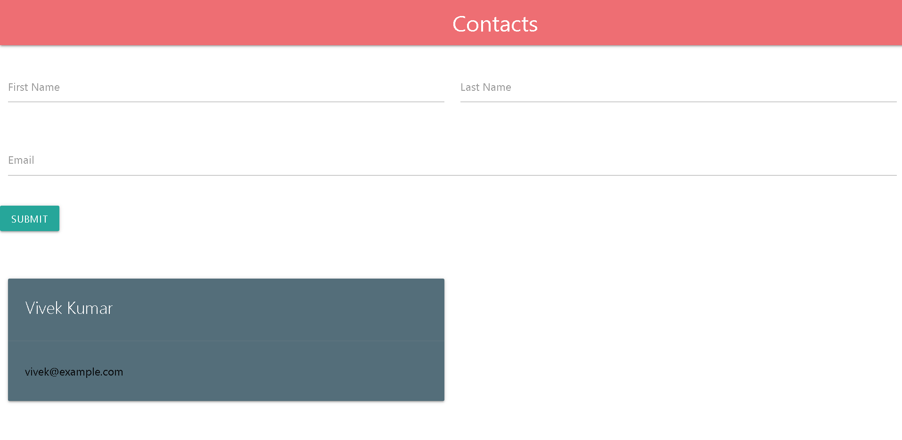

# 📇 Contact Management System (Full Stack)

A full-stack Contact Management System built using **Spring Boot**, **React**, **Docker**, and deployed on **Render Cloud**.

This project demonstrates REST API development, frontend-backend integration, Docker containerization, and real cloud deployment.

---

## 🌍 Live Demo

🔗 https://contact-management-system-2ydt.onrender.com/

> ⚠ Note: The app uses H2 in-memory database. Data resets when the server restarts (Render free tier behavior).

---

## 🏗 Architecture

This application follows a **single-port full-stack architecture**:

- React frontend is built and served from Spring Boot
- Spring Boot handles REST APIs
- Docker container used for deployment
- Hosted on Render Cloud

Everything runs from one public URL.

---

## 🛠 Tech Stack

### 🔹 Backend
- Java 17  
- Spring Boot  
- Spring Data JPA (Hibernate)  
- H2 Database  
- Maven  

### 🔹 Frontend
- React (Class Components)  
- Fetch API  
- Materialize CSS  

### 🔹 DevOps & Deployment
- Docker  
- Render Cloud  
- Git & GitHub  

---

## ✨ Features

- ✅ Add new contact  
- ✅ View all contacts  
- ✅ REST API integration  
- ✅ Real-time UI updates  
- ✅ Full-stack integration  
- ✅ Docker containerization  
- ✅ Cloud deployment (Render)  
- ✅ Single public URL  

---

## 📂 Project Structure

```
Contact-Management-System/
├── src/ (Spring Boot Backend)
│   └── main/
│       └── resources/
│           └── static/ (React production build)
├── client/ (React Source Code)
│   ├── src/
│   ├── public/
│   └── package.json
├── Dockerfile
├── pom.xml
└── README.md
```

---

## ⚙️ How To Run Locally

### 🔹 1. Clone Repository

```bash
git clone https://github.com/Vivekkushwahaofficial/Contact-Management-System.git
cd Contact-Management-System
```

---

### 🔹 2. Run Backend

```bash
mvn spring-boot:run
```

Open:
```
http://localhost:8080
```

---

### 🔹 3. Development Mode (Optional)

Run React separately:

```bash
cd client
npm install
npm start
```

Frontend:
```
http://localhost:3000
```

Backend:
```
http://localhost:8080
```

---

## 🐳 Docker Deployment

The project includes a Dockerfile.

To build and run locally:

```bash
docker build -t contact-app .
docker run -p 8080:8080 contact-app
```

---

## 🔌 API Endpoints

### 📍 Get All Contacts
```
GET /api/contacts
```

### 📍 Create Contact
```
POST /api/contacts
```

---

## 🧠 What I Learned

- REST API development with Spring Boot  
- Entity → Repository architecture  
- React frontend integration  
- Production build deployment  
- Docker containerization  
- Cloud deployment using Render  
- Git branching & rebasing  
- Full-stack application lifecycle  

---

## 📸 Screenshots



---

## 👨‍💻 Author

**Vivek Kushwaha**  
B.Tech CSE Student | Aspiring Full Stack Developer  

---

## ⭐ If you like this project, give it a star!
